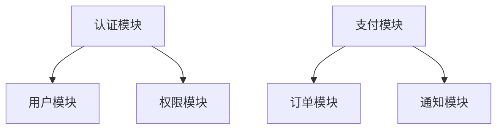

# 工作流优化计划

> 记录未来可实施的架构级改进，提升开发效率。

---

## 核心效率瓶颈分析

当前工作流的主要效率瓶颈：

1. **重复学习成本高**：每个项目都要重新学习，没有知识沉淀
2. **手动操作多**：启动环境、验证功能都要手动操作
3. **决策质量依赖经验**：架构变更影响判断不准确，导致返工
4. **重复劳动多**：相似代码从头写，相似问题重新诊断

---

## 优化方案

### 1. 项目知识库 ⭐⭐⭐⭐⭐（最高优先级）

**问题**：每个项目都要重新学习，没有知识沉淀

**解决方案**：在项目根目录建立 `knowledge/` 目录，包含：

```
knowledge/
├── patterns.md          # 常用代码模式
├── pitfalls.md          # 踩坑记录
├── best-practices.md    # 最佳实践
├── decisions.md         # 架构决策记录
└── module-context/      # 模块上下文
    ├── auth.md          # 认证模块上下文
    ├── payment.md       # 支付模块上下文
    └── ...
```

**效率提升**：
- 架构师读取知识库，快速了解项目上下文
- 避免重复踩坑，减少调试时间
- 提高决策质量，减少返工

**工作流改进**：
- 架构师启动时，先读取 `knowledge/decisions.md` 了解历史决策
- 操盘手遇到问题时，先查阅 `knowledge/pitfalls.md`
- 每次解决新问题后，更新知识库

**实施阶段**：第一阶段（立即实施）

---

### 2. 快速验证脚本库 ⭐⭐⭐⭐⭐（高优先级）

**问题**：每次验证都要手动操作，效率低

**解决方案**：在项目根目录建立 `scripts/` 目录，包含：

```
scripts/
├── verify.sh            # 一键验证所有功能
├── start-dev.sh         # 一键启动开发环境
├── test-auth.sh         # 测试认证模块
├── test-payment.sh      # 测试支付模块
└── clean.sh             # 清理环境
```

**效率提升**：
- 操盘手执行完代码后，直接运行 `scripts/verify.sh` 验证
- 减少手动操作时间，提高验证覆盖率
- 标准化验证流程，减少遗漏

**工作流改进**：
- 架构师输出执行指令时，附带验证脚本名称
- 操盘手执行完后，运行验证脚本确认功能正常
- 验证结果直接写入进度.md

**实施阶段**：第一阶段（立即实施）

---

### 3. 模块依赖图 ⭐⭐⭐⭐（高优先级）

**问题**：难以快速了解模块间依赖关系，变更影响判断不准确

**解决方案**：在架构.md中新增"模块依赖图"章节，用Mermaid图表展示：

```markdown
## 模块依赖图



**依赖关系说明**：
- 认证模块 → 用户模块：登录时需要获取用户信息
- 认证模块 → 权限模块：登录时需要验证权限
- 支付模块 → 订单模块：支付成功后更新订单状态
- 支付模块 → 通知模块：支付成功后发送通知
```

**效率提升**：
- 架构师能快速判断变更影响范围
- 减少因依赖关系不清晰导致的返工
- 提高架构决策质量

**工作流改进**：
- 架构师输出执行指令时，参考依赖图判断影响范围
- 模块变更后，同步更新依赖图

**实施阶段**：第一阶段（立即实施）

---

### 4. 代码模板库 ⭐⭐⭐⭐（中优先级）

**问题**：每次都要从头写相似代码，重复劳动多

**解决方案**：在项目根目录建立 `templates/` 目录，包含：

```
templates/
├── api/
│   ├── route.template.js      # API路由模板
│   └── handler.template.js    # API处理器模板
├── components/
│   ├── form.template.vue      # 表单组件模板
│   └── list.template.vue      # 列表组件模板
└── tests/
    ├── unit.template.js       # 单元测试模板
    └── integration.template.js # 集成测试模板
```

**效率提升**：
- 操盘手直接套用模板，减少重复编写
- 保持代码风格一致
- 提高代码质量

**工作流改进**：
- 架构师输出执行指令时，注明使用哪个模板
- 操盘手基于模板快速生成代码

**实施阶段**：第二阶段（后续优化）

---

### 5. 架构决策记录（ADR） ⭐⭐⭐（中优先级）

**问题**：架构决策没有记录，容易重复讨论相同问题

**解决方案**：在项目根目录建立 `docs/adr/` 目录，按序号记录决策：

```
docs/adr/
├── 001-选择微信小程序云开发.md
├── 002-使用云函数处理支付.md
├── 003-采用静态部署方案.md
└── ...
```

每个ADR包含：
- 标题
- 状态（提议/已接受/已废弃）
- 背景
- 决策
- 后果

**效率提升**：
- 避免重复讨论相同问题
- 新成员快速了解架构决策背景
- 提高决策质量

**工作流改进**：
- 架构师做重要决策时，创建ADR记录
- 架构师启动时，先读取最近的ADR了解决策背景

**实施阶段**：第二阶段（后续优化）

---

## 效率提升评估

| 改进项 | 效率提升 | 实现难度 | 优先级 | 实施阶段 |
|--------|----------|----------|--------|----------|
| 项目知识库 | ⭐⭐⭐⭐⭐ | 中 | 最高 | 第一阶段 |
| 快速验证脚本库 | ⭐⭐⭐⭐⭐ | 低 | 高 | 第一阶段 |
| 模块依赖图 | ⭐⭐⭐⭐ | 低 | 高 | 第一阶段 |
| 代码模板库 | ⭐⭐⭐⭐ | 中 | 中 | 第二阶段 |
| 架构决策记录 | ⭐⭐⭐ | 低 | 中 | 第二阶段 |

---

## 实施计划

### 第一阶段（立即实施）

**目标**：建立核心基础设施，快速见效

**任务清单**：
- [ ] 创建项目知识库模板
- [ ] 创建快速验证脚本模板
- [ ] 在架构.md中新增模块依赖图章节

**预期效果**：
- 减少重复学习时间 50%
- 减少手动验证时间 70%
- 提高架构决策准确率 40%

### 第二阶段（后续优化）

**目标**：完善工作流，提高代码质量

**任务清单**：
- [ ] 创建代码模板库
- [ ] 建立ADR记录机制

**预期效果**：
- 减少重复编码时间 60%
- 提高代码一致性 80%
- 减少重复讨论时间 50%

---

## 实施建议

1. **先实施项目知识库**：这是最核心的改进，能沉淀项目经验，避免重复学习
2. **再实施快速验证脚本库**：能快速见效，减少手动操作
3. **然后实施模块依赖图**：能提高架构决策质量，减少返工
4. **后续实施代码模板库和ADR**：进一步完善工作流

---

## 注意事项

- 这些改进是可选的，不是强制的
- 根据项目规模和复杂度选择实施
- 小项目可以只实施前3项
- 大项目建议全部实施
- 实施过程中要不断优化和调整